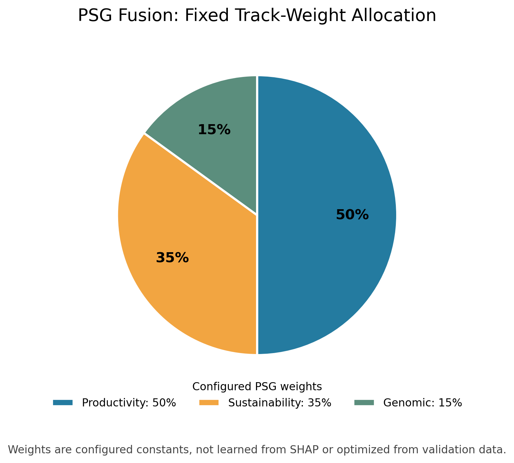
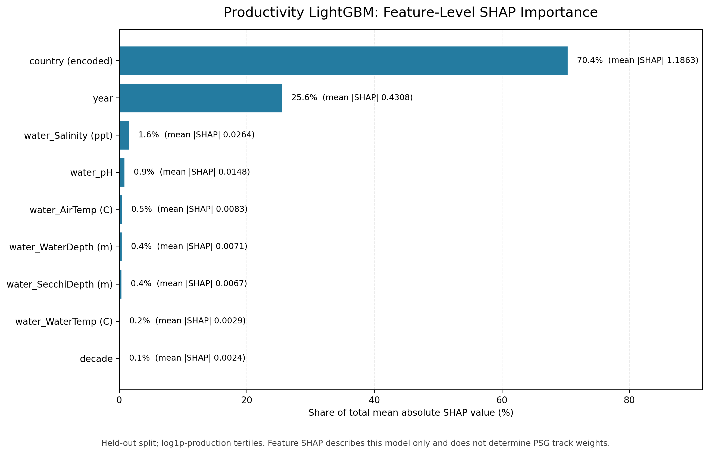

# Final Project Results Summary

<strong>Consolidated Evidence Report for Productivity, Sustainability, and Genomic Tracks</strong>

	
	
	

Generated: 2026-10-08

## Feature Cleanup Interpretation

The current results use the rebuilt official 9-column dataset: country, year, production, and six time-bucket water-quality features. Climate columns were excluded because the source covers 2024-2026 while production covers 1960-2018. Genomic global aggregates were excluded because no production-compatible join key exists. Country is label-encoded, year is numeric, decade is derived from year, and the production target uses log1p quantile construction. Earlier optimistic metrics that used zero-variance climate/genomic columns are not valid predictive evidence. The current PSG accuracy is 0.7407 and macro-F1 is 0.7405; these are the honest augmented-feature results.

## PSG Weighting and Feature Attribution

The implemented fusion rule uses fixed coefficients: Productivity 50%, Sustainability 35%, and Genomic 15%. Productivity has the largest configured coefficient because that is how the current rule is coded; the repository contains no documented learned-weight procedure or validation study establishing that 50/35/15 is optimal. The pie chart shows configured coefficients, not model-learned importance.

| Track | Configured weight | Realized mean contribution share on PSG held-out samples |
|---|---:|---:|
| Productivity | 50.0% | 50.0% |
| Sustainability | 35.0% | 34.9% |
| Genomic | 15.0% | 15.1% |

Configured weights reflect the current rule, not a learned optimum: Productivity is highest at 50%, Sustainability is 35%, and Genomic is 15%. The repository does not document a tuning or validation study that established this ratio; productivity's larger coefficient is a design choice, not a SHAP-derived conclusion.

The feature SHAP chart is computed for the selected productivity LightGBM model on its held-out split. It ranks input-feature influence within that model; it does not justify or estimate cross-track PSG weights. Current results rank country encoding and year highest. Country uses ordinal/label-style codes, which impose an artificial ordering, and year/decade are correlated; interpret those attributions cautiously. The six water inputs are time-bucket measurements, not country-specific observations.

### Productivity Feature SHAP Values

| Feature | Mean |SHAP| | Share of total (%) |
|---|---|---|
| country (encoded) | 1.1863 | 70.3699 |
| year | 0.4308 | 25.5567 |
| water_Salinity (ppt) | 0.0264 | 1.5682 |
| water_pH | 0.0148 | 0.8754 |
| water_AirTemp (C) | 0.0083 | 0.4941 |
| water_WaterDepth (m) | 0.0071 | 0.4216 |
| water_SecchiDepth (m) | 0.0067 | 0.3973 |
| water_WaterTemp (C) | 0.0029 | 0.1724 |
| decade | 0.0024 | 0.1445 |

## 1. Artifact Readiness Matrix
| Artifact | Path | Status |
|---|---|---|
| Productivity model | models/productivity_model.pkl | Available |
| Sustainability model | models/sustainability_model.pkl | Available |
| Genomic model | models/feature_selector.pkl | Available |
| Productivity metrics | results/productivity_metrics.csv | Available |
| Sustainability metrics | results/sustainability_metrics.csv | Available |
| Genomic metrics | results/janhavi_model_metrics.csv | Available |
| Genomic feature importance | results/genomic_feature_importance.csv | Available |
| Validation audit | results/validation_audit.md | Available |

## 2. Best Model Snapshots

### 2.1 Productivity Track (Best: LightGBM)
| Metric | Value |
|---|---|
| Accuracy | 0.9335 |
| Precision (macro) | 0.9337 |
| Recall (macro) | 0.9335 |
| F1 (macro) | 0.9336 |
| Training Time (s) | 0.3892 |
| Inference per 1000 rows (ms) | 11.8669 |
| Model Size (MB) | 2.4548 |
| Peak Train RAM (MB) | 1.1641 |

### 2.2 Sustainability Track (Best: XGBoost_rebuild)
| Metric | Value |
|---|---|
| Accuracy | 0.8362 |
| Precision (macro) | 0.8525 |
| Recall (macro) | 0.8362 |
| F1 (macro) | 0.8389 |

### 2.3 Genomic Track (Best: HistGB)
| Metric | Value |
|---|---|
| Accuracy | 0.8889 |
| Precision (macro) | 0.8909 |
| Recall (macro) | 0.8893 |
| F1 (macro) | 0.8899 |
| Training Time (s) | 0.6249 |
| Inference Time (s) | 0.0245 |

## 3. Full Benchmark Tables

### 3.1 Productivity Models
| model | train_accuracy | test_accuracy | accuracy | precision_macro | recall_macro | f1_macro | train_seconds | infer_ms_per_1000 | model_size_mb | peak_train_ram_mb |
|---|---:|---:|---:|---:|---:|---:|---:|---:|---:|---:|
| LightGBM | 0.9692 | 0.9335 | 0.9335 | 0.9337 | 0.9335 | 0.9336 | 0.3892 | 11.8669 | 2.4548 | 1.1641 |
| XGBoost | 0.9039 | 0.8606 | 0.8606 | 0.8606 | 0.8606 | 0.8606 | 0.7455 | 4.4762 | 1.4641 | 92.6719 |
| DecisionTree | 0.6773 | 0.6522 | 0.6522 | 0.6656 | 0.6519 | 0.6453 | 0.0231 | 1.8075 | 0.0320 | 0.1719 |
| ExtraTrees | 1.0000 | 0.5000 | 0.5000 | 0.5002 | 0.4999 | 0.5000 | 0.5468 | 31.8692 | 294.8443 | 316.2617 |
| RandomForest | 1.0000 | 0.4687 | 0.4687 | 0.4699 | 0.4686 | 0.4691 | 0.4813 | 22.5950 | 110.7611 | 136.5664 |
| LogisticRegression | 0.4065 | 0.3911 | 0.3911 | 0.3866 | 0.3908 | 0.3835 | 0.5516 | 1.8581 | 0.0071 | 1.2695 |

### 3.2 Sustainability Models
| model | accuracy | precision | recall | f1 |
|---|---:|---:|---:|---:|
| XGBoost_rebuild | 0.8362 | 0.8525 | 0.8362 | 0.8389 |

### 3.3 Genomic Models
| Model | Training_Time_s | Inference_Time_s | Accuracy | Precision_macro | Recall_macro | F1_Score_macro |
|---|---:|---:|---:|---:|---:|---:|
| NaiveBayes | 0.0098 | 0.0016 | 0.3919 | 0.3937 | 0.3965 | 0.3693 |
| KNN_k3 | 0.0171 | 0.0117 | 0.5776 | 0.5800 | 0.5790 | 0.5754 |
| KNN_k5 | 0.0177 | 0.0121 | 0.5823 | 0.5814 | 0.5843 | 0.5780 |
| KNN_k7 | 0.0175 | 0.0127 | 0.5836 | 0.5833 | 0.5851 | 0.5816 |
| SVM_linear | 3.7957 | 0.2242 | 0.3778 | 0.3978 | 0.3784 | 0.3499 |
| SVM_rbf | 3.1791 | 0.9947 | 0.4095 | 0.4080 | 0.4128 | 0.3993 |
| AdaBoost | 0.6350 | 0.0120 | 0.4494 | 0.4473 | 0.4513 | 0.4440 |
| HistGB | 0.6249 | 0.0245 | 0.8889 | 0.8909 | 0.8893 | 0.8899 |

## 4. Top Genomic Feature Drivers
| Feature | Mean Importance | Std |
|---|---:|---:|
| water_SecchiDepth (m) | 0.193433 | 0.001801 |
| water_pH | 0.045754 | 0.001292 |
| water_WaterDepth (m) | 0.025036 | 0.000903 |
| water_AirTemp (C) | 0.019889 | 0.000748 |
| country | 0.002295 | 0.000291 |

## 5. Integrated Inference Capability Status
1. Real-time synchronized multi-model predictions: Active.
2. Track-wise SHAP explainability with fallback paths: Active.
3. Forecasting with ARIMA/trend fallback: Active.
4. Scenario simulation with confidence deltas: Active.
5. Policy recommendation layer with model-conditioned logic: Active.

## 6. Governance Notes
1. This summary is a consolidated operational-research view and should be read alongside:
	 - results/validation_audit.md
	 - results/xai_evidence_report.md
2. Model outputs are predictive evidence and should be interpreted with domain and ecological validation.
